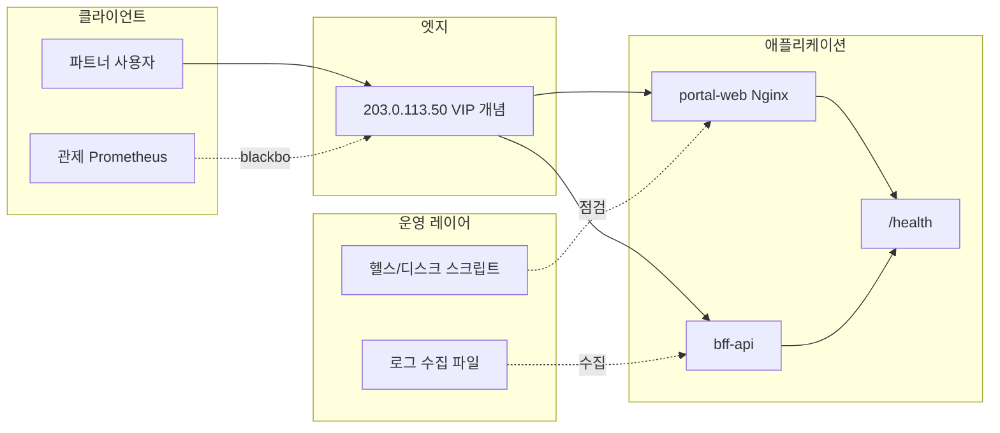

# 아키텍처 개요 (데모랩 가상 환경)

> 모든 이름·IP는 [더미 규약](DUMMY-CANON.md)을 따릅니다.

## 1. 논리 구성

로컬 **데모 스택**에서는 `LB`를 `localhost:8080` 포트 매핑으로 대체하고, `bff-api`는 문서상 존재만 표시합니다.

## 2. 컴포넌트 (가상 CMDB 발췌)

| 컴포넌트 | ID | 역할 | 이 저장소 구현 |
|----------|-----|------|----------------|
| 파트너 포털 | `DL-PORTAL` | 정적 안내·헬스 | `examples/demo-stack` |
| BFF API | `DL-BFF` | 주문 조회 API (가상) | 문서·알림 규칙에만 등장 |
| 로드밸런서 | `LB-LAB-01` | TLS 종료 (가상) | 데모에서는 생략 |
| 점프호스트 | `jmp-lab-01` | `10.50.0.10` | Ansible 인벤토리 예시 |
| 배포 파이프라인 | `REL-*` | 품질 게이트 | `docs/reference-github-actions-ci.yml` |
| 인프라 코드 | `IAC-LAB` | 재현 가능 환경 | `infra/terraform`, `infra/ansible` |

## 3. 데이터 흐름

1. 파트너 브라우저 → (가상) `https://portal.lab.demolab.internal` → `portal-web`.
2. 주문 API 호출 → (가상) `bff-api` (`10.60.0.21`) → (가상) `orders-db` (`10.70.0.5`).
3. 로컬 데모: `http://127.0.0.1:8080` → Nginx `index.html`, `GET /health` → `200 ok`.

## 4. 트래픽·용량 (더미 기준선)

| 지표 | Lab 기준선 | 비고 |
|------|------------|------|
| 포털 RPS | 12 req/s | 피크 시간대 가정 |
| BFF p99 지연 | 180ms | 알림 임계 예시용 |
| 5xx 비율 | 0.2% 미만 | `INC-2026-0412` 시나리오에서 초과 |

## 5. 확장 메모

- **다중 인스턴스**: `readiness` 분리, 세션 스티키 여부 결정.
- **비밀**: Vault 대신 Lab에서는 `.env` + 시크릿 매니저 **모의**만 문서화.
- **네트워크**: 앱 존 ↔ 데이터 존 ACL을 **포트 단위**로 명시.

## 6. 모니터링 Lab

- `examples/monitoring-lab`: Prometheus + **Alertmanager** + Blackbox(`/health` 프로브) + Grafana + Lab webhook sink.
- 설명 문서: [08-MONITORING-LAB.md](08-MONITORING-LAB.md)

## 7. 의존성

- Docker Engine + Compose v2 (데모·모니터링 Lab).
- Terraform 1.5+, Ansible 2.14+ (선택).
