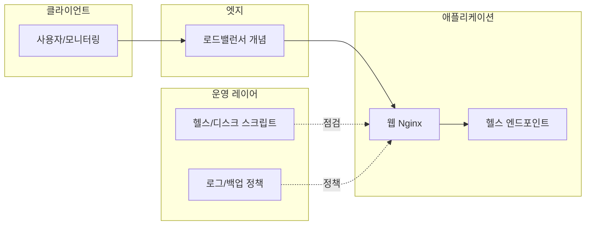

# 아키텍처 개요

## 1. 논리 구성

본 저장소의 **로컬 데모**에서는 `LB`를 Docker Compose의 포트 매핑으로 대체합니다.

## 2. 컴포넌트

| 컴포넌트 | 역할 | 이 저장소에서의 구현 |
|----------|------|---------------------|
| 웹 서버 | 정적 응답, `/health` | `examples/demo-stack` |
| 헬스 | 가용성 판단 | `GET /health` → 200 + 짧은 본문 |
| 배포 파이프라인 | 품질 게이트 | `.github/workflows/ci.yml` |
| 인프라 표현 | 재현 가능한 환경 정의 | `infra/terraform` (클라우드 비의존 예제) |
| 구성 관리 | 서버 기준선 | `infra/ansible` 샘플 |

## 3. 데이터 흐름 (데모)

1. 사용자가 `http://localhost:8080` 접속 → Nginx가 `index.html` 제공.
2. 모니터링/스크립트가 `http://localhost:8080/health` 폴링 → HTTP 상태로 UP/DOWN 판단.

## 4. 확장 시 고려사항 (면접/문서용 메모)

- **다중 인스턴스**: 헬스 외 **준비 상태(readiness)** 분리, 세션 고정 여부 결정.
- **비밀 관리**: Vault / 클라우드 시크릿 매니저, 런타임 주입만 허용.
- **네트워크**: 프라이빗 서브넷 + NAT, 관리용 베스천 또는 SSM 스타일 접근.

## 5. 의존성

- Docker Engine + Docker Compose v2 (데모 스택).
- 선택: Terraform 1.5+, Ansible 2.14+ (인프라 예제 실행 시).
