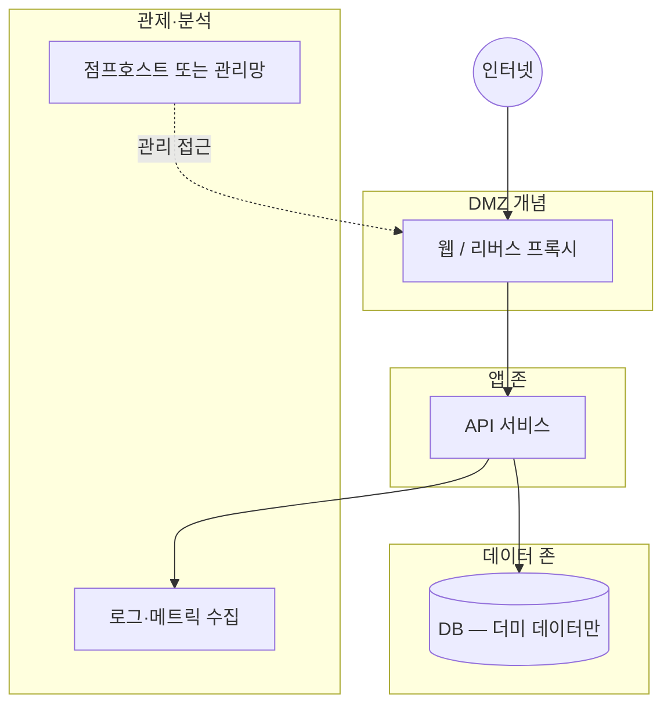

# 가상 연구 환경(Lab) 구성 개요

이 문서는 **교육·포트폴리오용 가상 토폴로지**입니다. IP·호스트명은 **예시**이며, 실제 조직과 무관합니다.

## 1. 목적

- **모의 관제**: 알림 → 분류 → 에스컬레이션 흐름을 안전하게 반복합니다.
- **모의 침해(윤리적)**: **본인 소유·허가된 범위**(로컬 VM, 클라우드 개인 샌드박스, CTF)에서만 수행합니다.

## 2. 논리 구성 (예시)

## 3. 세그먼트·자산 표 (가상)

| 존 | 예시 대역(문서용) | 역할 | 비고 |
|----|-------------------|------|------|
| 관리 | 10.50.0.0/24 | 점프, Ansible 제어 | SSH 키만, 비밀번호 로그인 금지 |
| 앱 | 10.60.0.0/24 | 서비스 VM / 컨테이너 노드 | 최소 권한 서비스 계정 |
| 데이터 | 10.70.0.0/24 | DB | 앱 존에서만 포트 개방 |

실제 구축 시에는 RFC1918 대역을 **충돌 없이** 다시 잡고, 방화벽 규칙을 **명시적 허용**으로 작성합니다.

## 4. 도구 예시 (선택)

| 용도 | 예시 도구 | 메모 |
|------|-----------|------|
| 가상화 | VirtualBox, Hyper-V, KVM | Windows 호스트에서도 가능 |
| 컨테이너 | Docker, kind | `examples/demo-stack`과 연계 가능 |
| 로그 | 파일 로그 + 간단 집계 | SIEM 대신 **연습용** 파이프라인 |
| 스캔(허가 범위) | 벤더 공식 스캐너, 오픈소스 | **스코프 외 IP는 절대 지정하지 않음** |

## 5. 운영 원칙

1. **허가 없는 시스템에 대한 스캔·침투는 불법**일 수 있습니다. Lab은 **본인 자산·계약된 범위**로만 제한합니다.
2. 덤프·캡처 파일에는 **개인정보·실키**를 넣지 않습니다.
3. 포트폴리오에 올리는 산출물은 **민감도를 낮춘 요약·다이어그램** 위주로 합니다.

다음 문서: [모의 관제 시나리오](06-MOCK-SOC-EXERCISE.md), [윤리적 모의 침해 Lab 기록 템플릿](07-ETHICAL-RED-TEAM-LAB-NOTES.md).
