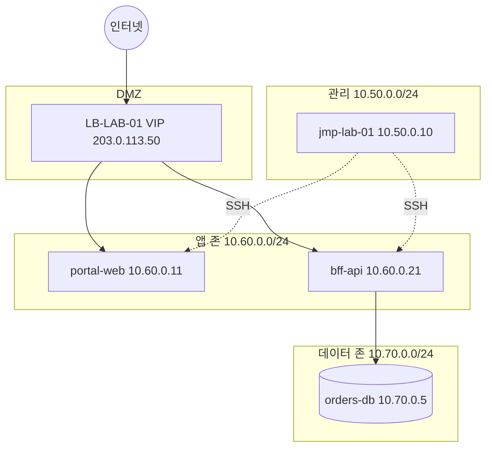

# 가상 연구 환경(Lab) — 데모랩 토폴로지

> 규약: [DUMMY-CANON.md](DUMMY-CANON.md)

## 1. 목적

- 모의 관제: `INC-2026-0412` 등 알림 흐름 반복.
- 윤리적 모의 침해: **Lab 대역**만 스코프에 명시.

## 2. 논리 구성

## 3. 자산 표 (CMDB 더미)

| 자산 ID | 이름 | IP | 서비스 코드 |
|---------|------|-----|-------------|
| VM-10511 | jmp-lab-01 | 10.50.0.10 | INFRA |
| VM-10522 | portal-web | 10.60.0.11 | DL-PORTAL |
| VM-10523 | bff-api | 10.60.0.21 | DL-BFF |
| VM-10530 | orders-db | 10.70.0.5 | DL-ORDERS-DB |

## 4. 도구 스택 (Lab)

| 계층 | 도구 |
|------|------|
| 컨테이너 | Docker, (선택) kind |
| 구성관리 | Ansible 샘플 |
| 인프라코드 | Terraform 샘플 |
| 로그 | 파일 → `examples/sample-data/app.log` |

## 5. 원칙

스코프 외 IP 스캔 금지. 증거 파일에 개인정보·실키 금지.

다음: [모의 관제](06-MOCK-SOC-EXERCISE.md), [윤리적 모의 침해](07-ETHICAL-RED-TEAM-LAB-NOTES.md).
